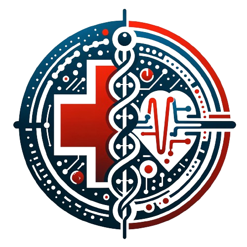
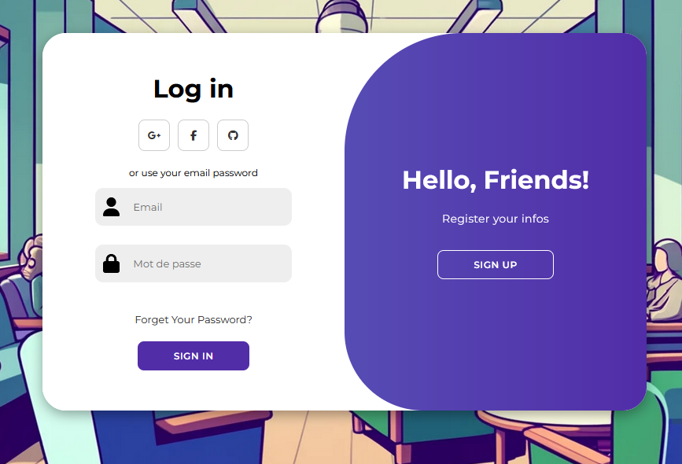
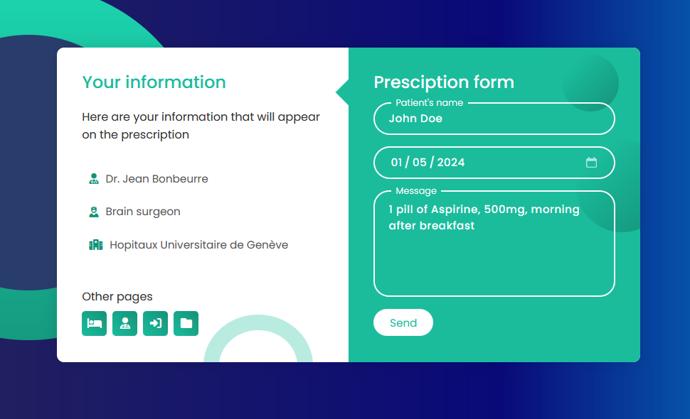
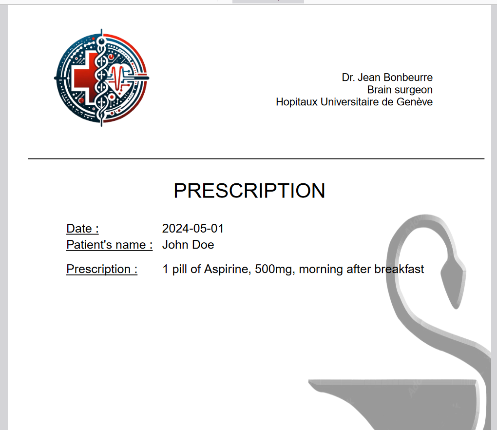

<!-- Improved compatibility of back to top link: See: https://github.com/othneildrew/Best-README-Template/pull/73 -->
<a name="readme-top"></a>
<!--
*** Thanks for checking out the Best-README-Template. If you have a suggestion
*** that would make this better, please fork the repo and create a pull request
*** or simply open an issue with the tag "enhancement".
*** Don't forget to give the project a star!
*** Thanks again! Now go create something AMAZING! :D
-->


<!-- PROJECT SHIELDS -->
<!--
*** I'm using markdown "reference style" links for readability.
*** Reference links are enclosed in brackets [ ] instead of parentheses ( ).
*** See the bottom of this document for the declaration of the reference variables
*** for contributors-url, forks-url, etc. This is an optional, concise syntax you may use.
*** https://www.markdownguide.org/basic-syntax/#reference-style-links
-->
[![Contributors][contributors-shield]][contributors-url]
[![Forks][forks-shield]][forks-url]
[![Stargazers][stars-shield]][stars-url]
[![Issues][issues-shield]][issues-url]
[![MIT License][license-shield]][license-url]
[![LinkedIn][linkedin-shield]][linkedin-url]


<!-- PROJECT LOGO -->
<br />
<div align="center">
  <a href="https://github.com/othneildrew/Best-README-Template">
    
  </a>

  <h3 align="center">Next Hospital's Read Me</h3>

  <p align="center">
    An awesome project to modernize IT structure of the Swiss Hospitals !
    <br />
    <a href="https://github.com/QuentinRiv/NextHospital"><strong>Explore the docs »</strong></a>
    <br />
    <br />

  </p>
</div>


<!-- TABLE OF CONTENTS -->
<details>
  <summary>Table of Contents</summary>
  <ol>
    <li>
      <a href="#about-the-project">About The Project</a>
      <ul>
        <li><a href="#built-with">Built With</a></li>
      </ul>
    </li>
    <li>
      <a href="#getting-started">Getting Started</a>
      <ul>
        <li><a href="#prerequisites">Prerequisites</a></li>
        <li><a href="#installation">Installation</a></li>
      </ul>
    </li>
    <li><a href="#usage">Usage</a></li>
    <li><a href="#roadmap">Roadmap</a></li>
    <li><a href="#contributing">Contributing</a></li>
    <li><a href="#license">License</a></li>
    <li><a href="#contact">Contact</a></li>
    <li><a href="#acknowledgments">Acknowledgments</a></li>
  </ol>
</details>


<!-- ABOUT THE PROJECT -->
## About The Project

Even today, in one of the most modern country in the world, so many hospital institutions are doing their administrative tasks with paper, in particular for their patients' data (appointment, prescriptions, and so on...).

What does this project want to propose :
* Show that a patient's data can be numerized, and used at different hospital
* Maintain a strong cybersecurity on such sensitive information
* A useful initiative for both doctors and patients

Of course, this is only a proposition, a proof of concept, made by my only two hands, which can always be improved.

<p align="right">(<a href="#readme-top">back to top</a>)</p>


### Built With

This project is based on the will to improve my Full Stack skills, meaning front-end, with HTML and CSS, and back-end, that is Node.JS and Javascript.

* [![Javascript][Javascript.com]][Javascript-url]
* [![Node][Node.com]][Node-url]
* [![HTML][HTML.com]][HTML-url]
* [![CSS][CSS.com]][CSS-url]

<p align="right">(<a href="#readme-top">back to top</a>)</p>


<!-- GETTING STARTED -->
## Getting Started
How to have this project run in your side :

### Prerequisites

First of all, NodeJS is the most important.
Go to : 
[https://nodejs.org/en/download](https://nodejs.org/en/download)
 and follow the instructions

### Installation

Then, you need to clone the project and install all the dependencies 

1. Get a free API Key on Mongoose website
2. Clone the repo
   ```sh
   git clone https://github.com/QuentinRiv/NextHospital.git
   ```
3. Install NPM packages
   ```sh
   npm install
   ```
4. Enter your API in `config.js`
   ```js
   npm run dev
   ```

<p align="right">(<a href="#readme-top">back to top</a>)</p>


<!-- USAGE EXAMPLES -->
## Usage

First, go to the [signup page](https://localhost:3000/auth/connect), create an account (you can put a fake email address), and login.

<div align="center">
    
</div>

According to if you signed up as a Doctor or a Patient, you will be redirected to a new page.
If you are a Patient, you will be on the patient main page, that sum up all your information :
* Access to your documents
* Previous consultations and appointments
* Booking new ones
* ...

If you are a Doctor, you will be on the doctor main page, with access to :
* your patient's info
* your past and incoming appointments
* a new page to create Prescriptions

<div align="center">
  
  
</div>

<p align="right">(<a href="#readme-top">back to top</a>)</p>


<!-- ROADMAP -->
## Roadmap

- [x] Add Changelog
- [x] Add back to top links
- [ ] Add Additional Templates w/ Examples
- [ ] Add "components" document to easily copy & paste sections of the readme
- [ ] Multi-language Support
    - [ ] Chinese
    - [ ] Spanish

See the [open issues](https://github.com/QuentinRiv/NextHospital/issues) for a full list of proposed features (and known issues).

<p align="right">(<a href="#readme-top">back to top</a>)</p>


<!-- CONTRIBUTING -->
## Contributing

Contributions are what make the open source community such an amazing place to learn, inspire, and create. Any contributions you make are **greatly appreciated**.

If you have a suggestion that would make this better, please fork the repo and create a pull request. You can also simply open an issue with the tag "enhancement".
Don't forget to give the project a star! Thanks again!

1. Fork the Project
2. Create your Feature Branch (`git checkout -b feature/AmazingFeature`)
3. Commit your Changes (`git commit -m 'Add some AmazingFeature'`)
4. Push to the Branch (`git push origin feature/AmazingFeature`)
5. Open a Pull Request

<p align="right">(<a href="#readme-top">back to top</a>)</p>


<!-- CONTACT -->
## Contact

Quentin Rivollat => quentin.rivollat@gmail.com

Project Link: [https://github.com/QuentinRiv/NextHospital](https://github.com/QuentinRiv/NextHospital)

<p align="right">(<a href="#readme-top">back to top</a>)</p>


<!-- ACKNOWLEDGMENTS -->
## Acknowledgments

Useful links ;)

* [Choose an Open Source License](https://choosealicense.com)
* [GitHub Emoji Cheat Sheet](https://www.webpagefx.com/tools/emoji-cheat-sheet)
* [Malven's Flexbox Cheatsheet](https://flexbox.malven.co/)
* [Malven's Grid Cheatsheet](https://grid.malven.co/)
* [Img Shields](https://shields.io)
* [GitHub Pages](https://pages.github.com)
* [Font Awesome](https://fontawesome.com)
* [React Icons](https://react-icons.github.io/react-icons/search)

<p align="right">(<a href="#readme-top">back to top</a>)</p>


<!-- MARKDOWN LINKS & IMAGES -->
<!-- https://www.markdownguide.org/basic-syntax/#reference-style-links -->
[contributors-shield]: https://img.shields.io/github/contributors/QuentinRiv/NextHospital?style=for-the-badge
[contributors-url]: https://github.com/QuentinRiv/NextHospital/contributors
[forks-shield]: https://img.shields.io/github/forks/QuentinRiv/NextHospital?style=for-the-badge
[forks-url]: https://github.com/QuentinRiv/NextHospital/members
[stars-shield]: https://img.shields.io/github/stars/QuentinRiv/NextHospital?style=for-the-badge
[stars-url]: https://github.com/QuentinRiv/NextHospital/stargazers
[issues-shield]: https://img.shields.io/github/issues/QuentinRiv/NextHospital?style=for-the-badge
[issues-url]: https://github.com/QuentinRiv/NextHospital/issues
[license-shield]: https://img.shields.io/github/license/QuentinRiv/NextHospital?style=for-the-badge
[license-url]: https://github.com/QuentinRiv/NextHospital/blob/master/LICENSE.txt
[linkedin-shield]: https://img.shields.io/badge/-LinkedIn-black.svg?style=for-the-badge&logo=linkedin&colorB=555
[linkedin-url]: https://linkedin.com/in/quentinrivollat
[product-screenshot]: images/screenshot.png
[Node.com]: https://img.shields.io/badge/NodeJS-green?style=for-the-badge&logo=node.js&logoColor=black
[Node-url]: https://nodejs.org/en
[Javascript.com]: https://img.shields.io/badge/Javascript-FFCC33?style=for-the-badge&logo=javascript&logoColor=black
[Javascript-url]: https://developer.mozilla.org/fr/docs/Web/JavaScript
[HTML.com]: https://img.shields.io/badge/HTML-FF3300?style=for-the-badge&logo=html5&logoColor=white
[HTML-url]: (https://developer.mozilla.org/fr/docs/Web/HTML)
[CSS.com]: https://img.shields.io/badge/CSS-00CCFF?style=for-the-badge&logo=css3&logoColor=white
[CSS-url]: (https://developer.mozilla.org/fr/docs/Web/CSS)
